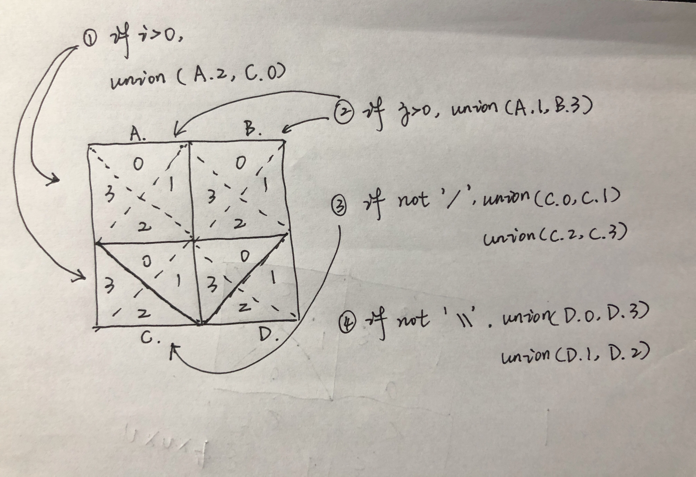

Time spent :  20 min(See hint)

GIVEN: In a N x N `grid` composed of 1 x 1 squares, each 1 x 1 square consists of a `/`, `\`, or blank space.  These characters divide the square into contiguous regions.

RETURNS: the number of regions.

EXAMPLES:

**Example 1:**

```
Input:
[
  " /",
  "/ "
]
Output: 2
Explanation: The 2x2 grid is as follows:

```


**Example 2:**

```
Input:
[
  " /",
  "  "
]
Output: 1
Explanation: The 2x2 grid is as follows:
```


**Example 3:**

```
Input:
[
  "\\/",
  "/\\"
]
Output: 4
Explanation: (Recall that because \ characters are escaped, "\\/" refers to \/, and "/\\" refers to /\.)
The 2x2 grid is as follows:
```


**Example 4:**

```
Input:
[
  "/\\",
  "\\/"
]
Output: 5
Explanation: (Recall that because \ characters are escaped, "/\\" refers to /\, and "\\/" refers to \/.)
The 2x2 grid is as follows:
```


**Example 5:**

```
Input:
[
  "//",
  "/ "
]
Output: 3
Explanation: The 2x2 grid is as follows:
```


Algorithm: UnionFind

Split a cell into 4 parts. 


